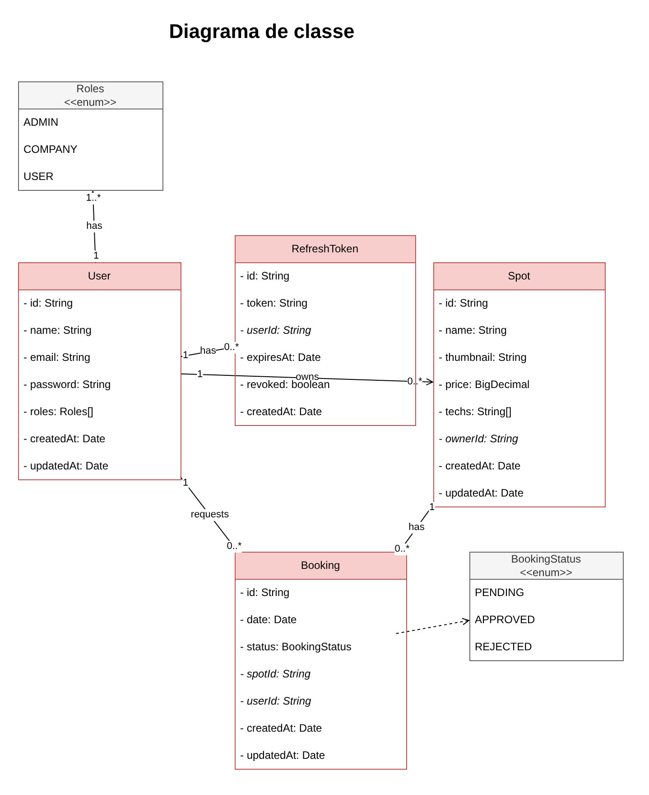
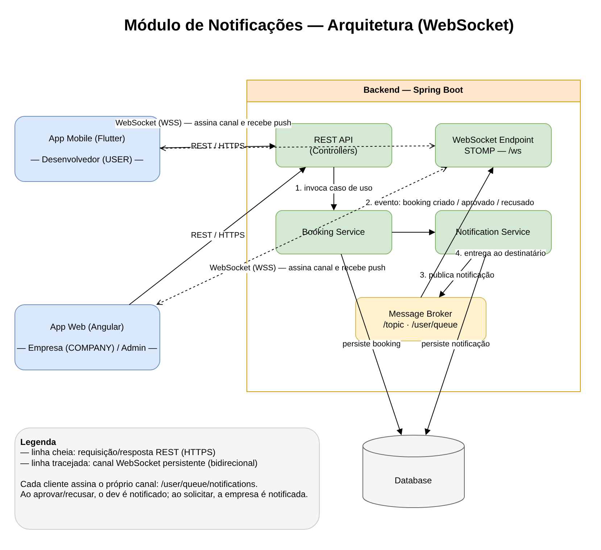

# Spot Manager

> Plataforma de agendamento de _spots_ entre empresas e desenvolvedores, com foco em networking.

## Sumário

1. [Visão Geral](#1-visão-geral)
2. [Objetivos do Projeto](#2-objetivos-do-projeto)
3. [Stack Tecnológica](#3-stack-tecnológica)
4. [Perfis de Usuário](#4-perfis-de-usuário)
5. [Requisitos Funcionais](#5-requisitos-funcionais)
6. [Requisitos Não Funcionais](#6-requisitos-não-funcionais)
7. [Regras de Negócio](#7-regras-de-negócio)
8. [Modelo de Dados](#8-modelo-de-dados)
9. [Fluxos Principais](#9-fluxos-principais)
10. [API REST (rascunho)](#10-api-rest-rascunho)
11. [Diagrama de Classes](#11-diagrama-de-classes)
12. [Módulo de Notificações (WebSocket)](#12-módulo-de-notificações-websocket)
13. [Como Executar](#13-como-executar)
14. [Roadmap](#14-roadmap)

---

## 1. Visão Geral

O **Spot Manager** é um projeto _full stack_ desenvolvido com o objetivo de colocar em
prática conhecimentos de arquitetura e desenvolvimento de sistemas.

A plataforma conecta **empresas** e **desenvolvedores** por meio de um sistema de
agendamentos. Empresas cadastram _spots_ (espaços/vagas para visitas e networking)
e os desenvolvedores podem solicitar agendamentos nesses spots. A empresa, então,
aceita ou recusa cada solicitação.

A aplicação também conta com um **painel administrativo** com indicadores e
métricas, como:

- Quantidade de usuários cadastrados;
- Quantidade de spots (empresas) cadastrados;
- Quantidade de agendamentos solicitados;
- Distribuição dos agendamentos por status.

## 2. Objetivos do Projeto

- Servir como estudo prático de desenvolvimento _full stack_.
- Aplicar conceitos de: arquitetura de software, autenticação/autorização,
  gerenciamento de estado, APIs REST, modelagem de banco de dados e boas práticas.
- Entregar três clientes consumindo a mesma API: web, mobile e painel admin.

## 3. Stack Tecnológica

| Camada      | Tecnologia                |
| ----------- | ------------------------- |
| Backend     | Java + Spring Boot        |
| Frontend    | Angular                   |
| Mobile      | Flutter                   |
| Banco       | MongoDB (Spring Data MongoDB) |
| Autenticação| JWT — _access token_ (curta duração) + _refresh token_ (persistido/revogável) |

> Itens marcados como _a definir_ ainda não foram decididos e devem ser
> atualizados conforme o projeto evoluir.

## 4. Perfis de Usuário

O acesso é controlado por papéis (`Roles`). Um usuário pode ter um ou mais papéis.

| Papel     | Descrição                                                                 |
| --------- | ------------------------------------------------------------------------- |
| `ADMIN`   | Acessa o painel administrativo, indicadores e métricas.                   |
| `COMPANY` | Representa uma empresa. Cadastra e gerencia spots; aceita/recusa agendamentos. |
| `USER`    | Desenvolvedor. Busca spots e solicita agendamentos.                       |

## 5. Requisitos Funcionais

- **RF01** — O usuário deve poder se cadastrar e autenticar.
- **RF02** — A empresa deve poder cadastrar, editar e remover seus spots.
- **RF03** — O desenvolvedor deve poder listar e filtrar spots (ex.: por tecnologia).
- **RF04** — O desenvolvedor deve poder solicitar um agendamento em um spot, informando a data.
- **RF05** — A empresa deve poder visualizar os agendamentos solicitados em seus spots.
- **RF06** — A empresa deve poder aprovar ou recusar um agendamento.
- **RF07** — O desenvolvedor deve poder acompanhar o status dos seus agendamentos.
- **RF08** — O administrador deve poder visualizar indicadores e métricas no painel.
- **RF09** — O sistema deve notificar os usuários em tempo real (via WebSocket):
  a empresa ao receber uma solicitação; o desenvolvedor ao ter o agendamento
  aprovado ou recusado.

## 6. Requisitos Não Funcionais

- **RNF01** — A API deve seguir o padrão REST.
- **RNF02** — As senhas devem ser armazenadas com hash (nunca em texto puro).
- **RNF03** — As rotas devem ser protegidas por autenticação e autorização por papel.
- **RNF04** — O backend deve validar os dados de entrada.
- **RNF05** — A mesma API deve atender web, mobile e painel admin.
- **RNF06** — A autenticação deve usar _access token_ de curta duração e
  _refresh token_ de longa duração, persistido e revogável (logout / logout global).

## 7. Regras de Negócio

- **RN01** — Um spot pertence a exatamente uma empresa (usuário com papel `COMPANY`).
- **RN02** — Apenas a empresa dona do spot pode editá-lo, removê-lo ou
  aprovar/recusar agendamentos relacionados a ele.
- **RN03** — Todo agendamento criado nasce com status `PENDING`.
- **RN04** — A partir de `PENDING`, o agendamento pode ir para `APPROVED` ou
  `REJECTED`. Esses estados são finais (definir se há reagendamento no roadmap).
- **RN05** — Um desenvolvedor não pode aprovar/recusar o próprio agendamento.

> Pontos em aberto a confirmar: é permitido reagendar um agendamento recusado?
> Existe limite de agendamentos simultâneos por desenvolvedor? O campo `price`
> do spot é cobrado ou apenas informativo?

## 8. Modelo de Dados

As entidades abaixo refletem o diagrama de classes (`diagram.drawio`).

### User

| Campo       | Tipo      | Observação                          |
| ----------- | --------- | ----------------------------------- |
| `id`        | String    | Identificador único                 |
| `name`      | String    |                                     |
| `email`     | String    | Único; usado no login               |
| `password`  | String    | Armazenado com hash                 |
| `roles`     | Roles[]   | Um ou mais papéis                   |
| `createdAt` | Date      |                                     |
| `updatedAt` | Date      |                                     |

### Spot

| Campo       | Tipo       | Observação                          |
| ----------- | ---------- | ----------------------------------- |
| `id`        | String     | Identificador único                 |
| `name`      | String     |                                     |
| `thumbnail` | String     | URL da imagem                       |
| `price`     | BigDecimal | Valor (a confirmar se é cobrado)    |
| `techs`     | String[]   | Tecnologias relacionadas            |
| `ownerId`   | String     | FK → User (empresa dona do spot)    |
| `createdAt` | Date       |                                     |
| `updatedAt` | Date       |                                     |

### Booking

| Campo       | Tipo          | Observação                          |
| ----------- | ------------- | ----------------------------------- |
| `id`        | String        | Identificador único                 |
| `date`      | Date          | Data solicitada para a visita       |
| `status`    | BookingStatus | `PENDING` por padrão                |
| `spotId`    | String        | FK → Spot                           |
| `userId`    | String        | FK → User (desenvolvedor)           |
| `createdAt` | Date          |                                     |
| `updatedAt` | Date          |                                     |

### RefreshToken

Token de longa duração, persistido para permitir **revogação** (logout e
invalidação de sessões).

| Campo       | Tipo    | Observação                                       |
| ----------- | ------- | ------------------------------------------------ |
| `id`        | String  | Identificador único                              |
| `token`     | String  | Valor do refresh token (idealmente armazenado com hash) |
| `userId`    | String  | FK → User (dono do token)                        |
| `expiresAt` | Date    | Data de expiração                                |
| `revoked`   | boolean | Se já foi invalidado (logout / rotação)          |
| `createdAt` | Date    |                                                  |

### Enums

- **Roles**: `ADMIN`, `COMPANY`, `USER`
- **BookingStatus**: `PENDING`, `APPROVED`, `REJECTED`

### Relacionamentos

- `User` (COMPANY) **1 — 0..\*** `Spot` (uma empresa possui vários spots).
- `User` (developer) **1 — 0..\*** `Booking` (um desenvolvedor faz vários agendamentos).
- `Spot` **1 — 0..\*** `Booking` (um spot recebe vários agendamentos).
- `User` **1 — 0..\*** `RefreshToken` (um usuário pode ter vários tokens ativos — ex.: um por dispositivo).

### Persistência (MongoDB)

Os dados são armazenados no **MongoDB** via **Spring Data MongoDB**. Cada
entidade vira uma **collection** (`users`, `spots`, `bookings`, `refreshtokens`).

- **Identificadores:** `id` mapeado para o `_id` do documento (`ObjectId`
  serializado como `String`).
- **Relacionamentos por referência:** os relacionamentos são guardados como o
  **id do documento referenciado** (`ownerId`, `spotId`, `userId`,
  `recipientId`, `bookingId`) — padrão _referenced_ do MongoDB, não há
  _join_/FK do banco; a associação é resolvida pela aplicação.
- **Arrays:** `roles` e `techs` são arrays nativos no documento.
- **Tipos:** `BigDecimal` (`price`) é persistido como `Decimal128`.
- **Auditoria:** `createdAt`/`updatedAt` via auditing do Spring Data
  (`@CreatedDate` / `@LastModifiedDate`).
- **Índices recomendados:** `users.email` (único); `spots.ownerId`;
  `bookings.spotId`, `bookings.userId`; `refreshtokens.token` (único) e
  TTL/`expiresAt` para expirar tokens automaticamente.

> Decisão de modelagem: optou-se por **referências** (e não documentos
> embutidos), pois spots, bookings e tokens são consultados de forma
> independente. Casos pontuais podem embutir _snapshots_ (ex.: nome do spot no
> booking) se necessário por performance.

## 9. Fluxos Principais

**Cadastro e autenticação**

1. Usuário se cadastra informando dados e papel(is).
2. Usuário autentica e recebe um **access token** (curta duração) e um
   **refresh token** (longa duração, persistido).
3. As requisições usam o access token. Quando ele expira, o cliente chama
   `/auth/refresh` enviando o refresh token e recebe um novo access token
   (com rotação do refresh token).
4. No **logout**, o refresh token é marcado como `revoked` e deixa de ser aceito.

**Empresa cadastra um spot**

1. Empresa autenticada cria um spot (nome, techs, thumbnail, etc.).
2. O spot fica disponível na listagem para desenvolvedores.

**Desenvolvedor solicita agendamento**

1. Desenvolvedor busca/filtra spots.
2. Solicita agendamento em um spot, informando a data.
3. Agendamento é criado com status `PENDING`.

**Empresa responde ao agendamento**

1. Empresa visualiza agendamentos pendentes dos seus spots.
2. Aprova (`APPROVED`) ou recusa (`REJECTED`).
3. Desenvolvedor acompanha a mudança de status.

**Painel administrativo**

1. Admin acessa o painel.
2. Visualiza métricas agregadas (usuários, spots, agendamentos por status).

## 10. API REST (rascunho)

> Esboço inicial — caminhos e contratos serão refinados durante a implementação.

| Método | Rota                         | Papel    | Descrição                         |
| ------ | ---------------------------- | -------- | --------------------------------- |
| POST   | `/auth/register`             | público  | Cadastro de usuário               |
| POST   | `/auth/login`                | público  | Autenticação (retorna access + refresh token) |
| POST   | `/auth/refresh`              | público* | Troca um refresh token válido por um novo access token |
| POST   | `/auth/logout`               | autenticado | Revoga o refresh token (encerra a sessão) |
| GET    | `/spots`                     | autenticado | Lista/filtra spots             |
| POST   | `/spots`                     | COMPANY  | Cria um spot                      |
| GET    | `/spots/{id}`                | autenticado | Detalhe de um spot             |
| PUT    | `/spots/{id}`                | COMPANY  | Edita um spot (dono)              |
| DELETE | `/spots/{id}`                | COMPANY  | Remove um spot (dono)             |
| POST   | `/spots/{spotId}/bookings`   | USER     | Solicita um agendamento           |
| GET    | `/bookings`                  | USER     | Agendamentos do usuário logado    |
| GET    | `/spots/{spotId}/bookings`   | COMPANY  | Agendamentos de um spot (dono)    |
| POST   | `/bookings/{id}/approve`     | COMPANY  | Aprova um agendamento             |
| POST   | `/bookings/{id}/reject`      | COMPANY  | Recusa um agendamento             |
| GET    | `/admin/metrics`             | ADMIN    | Indicadores do painel             |

> \* `/auth/refresh` não exige _access token_, mas exige um _refresh token_
> válido e não revogado.

## 11. Diagrama de Classes

Os diagramas estão em [`diagram.drawio`](./diagram.drawio), que pode ser aberto
no [diagrams.net](https://app.diagrams.net) ou pela extensão do VS Code
_Draw.io Integration_. O arquivo tem **duas páginas**:

- **Diagrama de classe** — entidades e relacionamentos (seção 8).
- **Notificações — Arquitetura** — arquitetura do módulo de notificações (seção 12).



> As imagens em `docs/` são exportadas de `diagram.drawio`. Ao alterar o
> diagrama, reexporte as duas páginas para manter o README atualizado.

## 12. Módulo de Notificações (WebSocket)

Notificações em tempo real para os eventos de agendamento, entregues por
**WebSocket** (sobre STOMP, padrão no Spring Boot). A arquitetura está na página
_"Notificações — Arquitetura"_ do `diagram.drawio`.



### Como funciona

- Cada cliente (app mobile do desenvolvedor e app web da empresa) mantém uma
  conexão WebSocket persistente com o backend (`/ws`) e assina o **seu próprio
  canal** privado: `/user/queue/notifications`.
- As ações continuam sendo feitas via **REST** (criar/aprovar/recusar agendamento).
  A notificação é um **efeito colateral** desse fluxo, não substitui a chamada REST.
- Quando o `Booking Service` processa um evento, ele aciona o
  `Notification Service`, que **persiste** a notificação e a **publica** no broker;
  o broker entrega ao canal do destinatário e o cliente recebe o push pela
  conexão WebSocket já aberta.

### Eventos que geram notificação

| Evento                                   | Quem é notificado            | Canal                       |
| ---------------------------------------- | ---------------------------- | --------------------------- |
| Agendamento solicitado (`PENDING`)       | Empresa dona do spot (web)   | `/user/queue/notifications` |
| Agendamento aprovado (`APPROVED`)        | Desenvolvedor (mobile)       | `/user/queue/notifications` |
| Agendamento recusado (`REJECTED`)        | Desenvolvedor (mobile)       | `/user/queue/notifications` |

### Entidade planejada — `Notification`

Ainda não modelada no diagrama de classes; proposta inicial:

| Campo         | Tipo              | Observação                                  |
| ------------- | ----------------- | ------------------------------------------- |
| `id`          | String            | Identificador único                         |
| `recipientId` | String            | FK → User (quem recebe)                      |
| `type`        | NotificationType  | `BOOKING_REQUESTED`, `BOOKING_APPROVED`, `BOOKING_REJECTED` |
| `message`     | String            | Texto exibido                               |
| `read`        | boolean           | Lida ou não                                 |
| `bookingId`   | String            | FK → Booking (referência do evento)         |
| `createdAt`   | Date              |                                             |

> Pontos em aberto: as notificações são persistidas (histórico/badge de não
> lidas) ou apenas enviadas ao vivo? Haverá fallback (push notification mobile)
> quando o cliente estiver offline?

## 13. Como Executar

> Seções a preencher conforme cada módulo for criado.

### Backend (Spring Boot)

```bash
# pré-requisitos: JDK, Maven/Gradle e MongoDB (local ou via Docker)
# comandos a definir
```

### Frontend (Angular)

```bash
# pré-requisitos: Node.js e Angular CLI
# comandos a definir
```

### Mobile (Flutter)

```bash
# pré-requisitos: Flutter SDK
# comandos a definir
```

## 14. Roadmap

- [x] Definir banco de dados (MongoDB) e estratégia de autenticação (JWT + refresh token).
- [ ] Configurar a conexão MongoDB e mapear as collections (Spring Data MongoDB).
- [ ] Modelar e implementar a API (auth, spots, bookings, métricas).
- [ ] Implementar o módulo de notificações (WebSocket/STOMP) e a entidade `Notification`.
- [ ] Implementar o frontend web (Angular).
- [ ] Implementar o app mobile (Flutter).
- [ ] Implementar o painel administrativo.
- [ ] Decidir regras em aberto (reagendamento, limites, cobrança do `price`).
